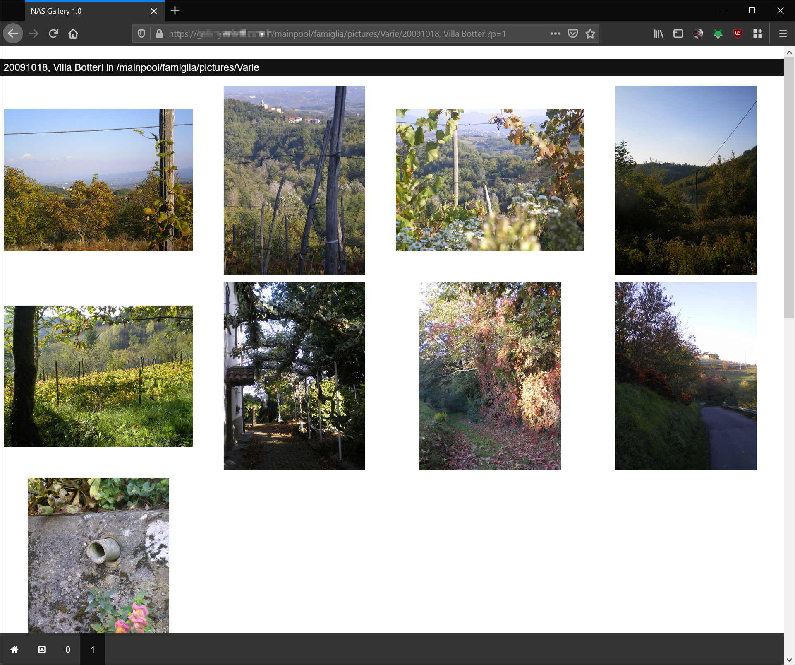
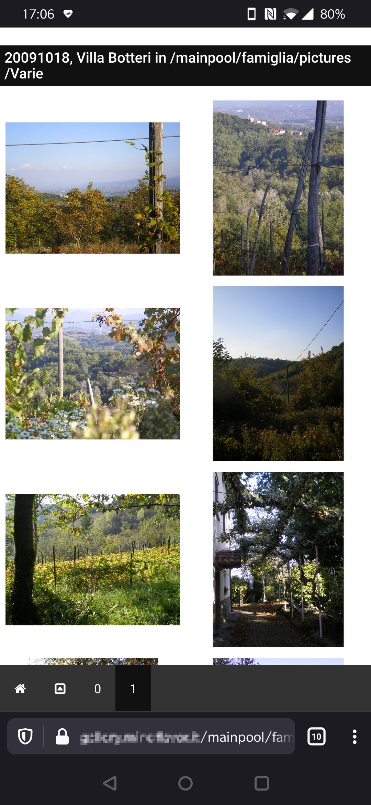
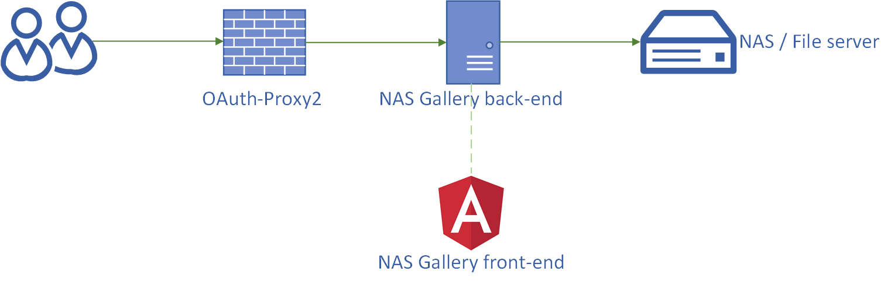

# NAS picture gallery

   

Using a browser | Using an Android device
-- | --
 | 

## Why?

So you have a lot of pictures in your NAS and no way to share them? Did you take a lot of pictures at last party and want to share them to other people *without* resorting to a social network? Would you like to browse your pictures from a handheld device *without* uploading them to the cloud? If yes, and you have some basic docker skills, this program is for you. 

NAS Gallery does just what you expect it to do: you point it to a folder and it creates a browsable gallery of its pictures and videos. Simple and effective. It also allows you to browse the subdirectories (you spent days organizing your photos, didn't you?). 

NAS Gallery also allows you, optionally, you to specify who can access each folder: this way you can safely share the kid's pictures with your in-laws while keeping the "other" pictures for yourself only. The configuration can be as complex as you like.

## How?

NAS Gallery is comprised of three components: 

1. A REST back-end written in Rust ([Rocket](https://rocket.rs/)). The back-end handles the creation of thumbnails and the enforcement of the ACLs. It also streams the files as needed so you can serve large video files without having an enterprise-class computer. Also, being Rust, it's pretty fast.
2. An Angular front-end for the data visualization. At this stage the front-end does not use Angular routing but care has been taken to allow permanent links. This way you can share a URL of a picture and the recipient will open it (provided they have the proper authorization of course).
3. An authentication proxy. The proxy is [oauth2-proxy](https://github.com/oauth2-proxy/oauth2-proxy) - an external unaffiliated project. The proxy handles authentication so NAS Gallery does not have to do it itself. It also means we are using a great, secure program for this sensitive task!

The authentication proxy is optional. If you do not care about authentication and authorization you can freely skip it as demonstrated in [simple deploy](docs/simple_deploy.md).

## Getting started

While you can run NAS Gallery as an executable, it's way easier use docker compose. Simple and complex docker-compose template files are available under the [docker-compose](https://github.com/MindFlavor/nas_gallery/tree/master/docker-compose) folder. Following is the simple deploy, for the advanced one please refer to [complete deploy](docs/complete_deploy.md).

1. Clone the repo: `git clone https://github.com/MindFlavor/nas_gallery.git`
2. Build the image `cd nas_gallery && docker build -t nas_gallery .`
3. Copy the [docker-compose.yml simple file](https://github.com/MindFlavor/nas_gallery/blob/master/docker-compose/simple/docker-compose.yml) to a directory of your choice.
4. Edit the `docker-compose.yml` file: find the line mapping `- /your_folder:/mnt/nas` and replace `/your_folder` with your path (you might need to change port if it's already in use).
5. Start the container with `docker-compose up`. 
6. Browse http::<your_server_ip> and profit!

> Step 1 and 2 will become unnecessary after I have published the image in the public docker registry.

This setup is fine for an internal networks **only** since there is no authentication. 

## License

This program won't be very appealing if it costed you money, right? Well it's free, open source and under [MIT License](LICENSE). 

## Contributing

Every contribution is welcome, no formality required: just open an issue or PR. Keep in mind this is a pet project: while I use it every day and thus I am personally interested, I cannot make guarantees of response time. 

Cheers,
Francesco
